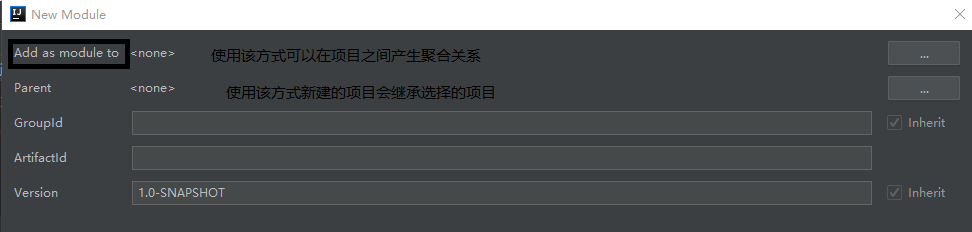

# 坐标的概念
中央仓库每一个jar都有一个唯一坐标，通过坐标可以精确确定是哪个jar。坐标组成：
1. GroupID：公司名，一般公司网址倒写
2. ArtifactID：项目名
3. Version：版本

# maven中新建项目的类型：
1. jar：Java项目
2. war：web项目
3. pom：项目对象


# POM
项目对象模型，把一个项目当成一个对象来看待，通过maven构建工具可以让项目和项目之间产生关系

# 使用maven新建Java项目的目录结构
```
|-pom.xml：maven的配置文件
|
|-src-|-mian-|-java：存放Java目录
      |      |
      |      |-resource：存放配置文件，编译后所有的配置文件都会被放入项目根目录下
      |
      |-test：存放测试Java代码
```
pom.xml：maven的配置文件，可以配置当前项目所依赖的其他项目或jar或插件


## 在一个maven项目中新建module


# maven项目之间的关系
## 依赖关系：
在项目中可以使用导入依赖的包的类和方法。相当于把一个项目导出为一个jar包，然后导入该项目
* 在pom.xml文件中使用dependency标签导入依赖项目

## 继承关系：
maven项目之间可以创建继承关系。
* 创建子项目：在新建maven项目可以选择该项目的父项目，选择一个父项目后新建的这个项目就成了这个父项目的子项目
* 选择一个父项目后，子项目会使用和父项目相同的GroupID
* 新建成的子项目中的pom.xml配置文件中会生成一个parent标签，标签中配置父项目的信息
    ```xml
    <parent>
        <artifactId>java</artifactId>
        <groupId>com.mh</groupId>
        <version>1.0-SNAPSHOT</version>
        <relativePath>../java/pom.xml</relativePath>
    </parent>
    ```

## 聚合关系
前提是继承关系，父项目会把子项目包含在父项目中。
* 创建项目时选择Add as module to选项选择父项目可以创建一个聚合关系的子项目
* 也可以选择父项目右键新建module，会自动把该项目作为聚合关系的父项目

* 创建成功后父项目的pom.xml文件中会生成一个modules标签，标签中标明了该项目的聚合关系的子项目
    ```xml
    <modules>
        <module>javachild2</module>
    </modules>
    ```
* 父项目和子项目之间的的版本管理：
    1. 一般父项目中引入的包可以直接在子项目中引用。
    2. 版本管理：可以在父项目中包的dependencies标签前添加dependencyManagement标签，该标签不会引入包，而是只声明包的版本
        ```xml
        <dependencyManagement>
            <dependencies>
                <dependency>
                    <groupId>org.springframework</groupId>
                    <artifactId>spring-core</artifactId>
                    <version>5.1.2.RELEASE</version>
                </dependency>
            </dependencies>
        <dependencyManagement>
        ```
