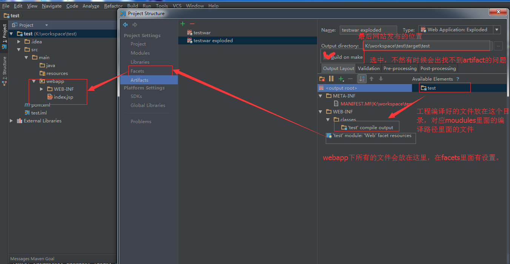

# 使用Maven新建web项目（传统项目）
1. 在maven安装目录下配置maven配置文件setting.xml。配置maven仓库和国内镜像

2. 在idea中配置maven相关信息，安装位置和配置文件的位置
3. 新建maven项目，普通java项目不勾选Create from archetype选项，web项目勾选并在下面选择maven-archetype-webapp选项。next
4. 填写GroupId为组织名称，ArtifactId为项目名或模块名。next
5. 填写项目名或模块名
6. 在mian目录下新建java文件夹，并右键Mark Dirctory As选择Sources Root，即把该文件夹声明为源码文件夹
    * 或者打开Project Structure--Modules--新建的模块--sources中设置
7. 设置artificat 
8. 配置运行环境
9. 在java文件夹下新建相应的包并编写代码

## 需要导入的包：
1. javaee
2. myBatis, myBatis-Spring
3. Spring相关
4. AOP依赖
5. apache文件上传和下载
6. json转换jackson

# 使用Maven新建分布式项目